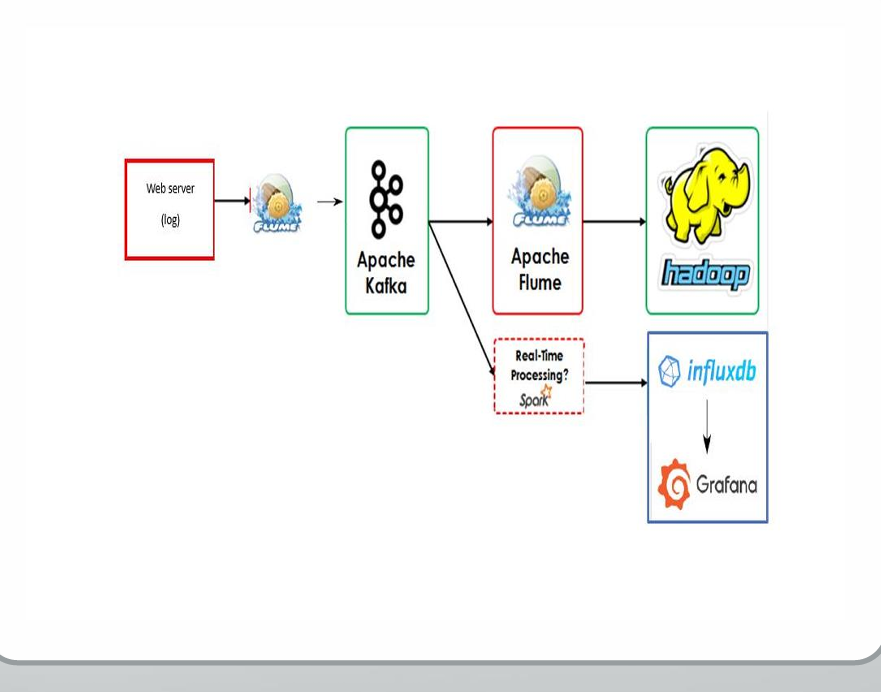

# Real-Time Data Processing Pipeline

This project is a data processing pipeline designed for real-time data ingestion, processing, and storage, leveraging Apache Kafka, Apache Flume, Apache Hadoop, and Spark, with visualization provided through Grafana and InfluxDB.

## Overview

This pipeline captures web server logs, processes them in real time, and stores them in both Hadoop (for long-term storage) and InfluxDB (for visualization in Grafana). The pipeline architecture ensures scalability, durability, and low latency.

 <!-- Replace `path-to-image` with the actual image path in the repository. -->

### Components

1. **Web Server (Log Source)**: Generates logs to be processed in real time.
2. **Apache Flume**: Collects logs from the web server and forwards them to Kafka.
3. **Apache Kafka**: Acts as a distributed messaging system to manage log streaming.
4. **Apache Hadoop**: Stores logs in HDFS for batch processing and analysis.
5. **Apache Spark** (Optional): Used for real-time processing if required.
6. **InfluxDB**: Time-series database for storing metrics.
7. **Grafana**: Visualization tool to monitor the pipeline metrics in real-time.

## Pipeline Flow

1. **Data Ingestion**: Web server logs are collected by Apache Flume and sent to Kafka.
2. **Data Streaming**: Kafka streams the logs to multiple sinks for parallel processing.
3. **Data Storage**:
   - Logs are sent to HDFS for long-term storage.
   - Metrics are stored in InfluxDB for visualization.
4. **Visualization**: Grafana pulls data from InfluxDB for real-time monitoring.

## Configuration Files

### 1. Kafka Configuration (in Spark)
Define Kafka configuration in your Spark application for data ingestion and streaming.

```python
import requests
import time
import json
import os
from datetime import datetime

# Directory to save response files
output_dir = "/home/bigdata/Desktop/pop"  # Modify this to match your desired directory
os.makedirs(output_dir, exist_ok=True)  # Create directory if it doesn't exist

while True:
    try:
        # Connect to the API to get a response
        response = requests.get("https://datausa.io/api/data?drilldowns=Nation&measures=Population")
        if response.status_code == 200:
            fetched_data = response.json()

            # Create a unique filename based on the current timestamp
            timestamp = datetime.now().strftime("%Y%m%d_%H%M%S")
            filename = os.path.join(output_dir, f"response_{timestamp}.json")

            # Write the response to a separate file
            with open(filename, 'w') as json_file:
                json.dump(fetched_data, json_file, indent=None)  # Pretty print JSON

            print(f"Data logged to file: {filename}")
        else:
            print("Failed to fetch data from API")

    except Exception as e:
        print(f"An error occurred: {e}")

    time.sleep(1)  # Wait for 1 seconds before the next fetch 


```

### 2. Flume Configuration

**Agent 1** (Web Server Logs to Kafka):

```properties
s# Name the components on this agent
a1.sources = r1
a1.sinks = k1
a1.channels = c1

# Describe/configure the source
a1.sources.r1.type = spooldir
a1.sources.r1.channels = c1

#Modify this to match your directory
a1.sources.r1.spoolDir = /home/bigdata/Desktop/pop

a1.sources.r1.fileHeader = true

a1.sinks.k1.channel = c1
a1.sinks.k1.type = org.apache.flume.sink.kafka.KafkaSink

#Modify this to match your topic name
a1.sinks.k1.kafka.topic = pop 

a1.sinks.k1.kafka.bootstrap.servers = localhost:9092
a1.sinks.k1.kafka.flumeBatchSize = 20
a1.sinks.k1.kafka.producer.acks = 1
a1.sinks.k1.kafka.producer.linger.ms = 1
a1.sinks.k1.kafka.producer.compression.type = snappy

# Use a channel which buffers events in memory
a1.channels.c1.type = memory
a1.channels.c1.capacity = 1000
a1.channels.c1.transactionCapacity = 1000

# Bind the source and sink to the channel
a1.sources.r1.channels = c1
a1.sinks.k1.channel = c1

```

**Agent 2** (Kafka to HDFS):

```properties
# Name the components on this agent
a2.sources = r2
a2.sinks = k2
a2.channels = c2

# Describe/configure the source
a2.sources.r2.type = org.apache.flume.source.kafka.KafkaSource
a2.sources.r2.channels = c2
a2.sources.r2.batchSize = 5000
a2.sources.r2.batchDurationMillis = 2000
a2.sources.r2.kafka.bootstrap.servers = localhost:9092

#Modify this to match your topic name
a2.sources.r2.kafka.topics = pop

# Describe the sink
a2.sinks.k2.type = hdfs
a2.sinks.k2.channel = c2

#Modify this to match your desired HDFS directory
a2.sinks.k2.hdfs.path = /case_pop
a2.sinks.k2.hdfs.filePrefix = events-
a2.sinks.k2.hdfs.round = true
a2.sinks.k2.hdfs.roundValue = 10 
a2.sinks.k2.hdfs.roundUnit = minute

# Use a channel which buffers events in memory
a2.channels.c2.type = memory
a2.channels.c2.capacity = 5000
a2.channels.c2.transactionCapacity = 5000

# Bind the source and sink to the channel
a2.sources.r2.channels = c2
a2.sinks.k2.channel = c2

```

### 3. Spark Application

Process data from Kafka in Spark with a schema applied to parse JSON data.

```python
import kafka
import requests
from pyspark.sql import SparkSession
from pyspark.sql.functions import col, from_json, explode
from pyspark.sql.types import StructType, StructField, StringType, IntegerType, ArrayType

# Initialize Spark session with Kafka support
spark = SparkSession.builder \
    .appName("Kafka-PySpark-Integration") \
    .config("spark.jars.packages", "org.apache.spark:spark-sql-kafka-0-10_2.12:3.0.1") \
    .getOrCreate()

# InfluxDB Configuration
influxdb_url = "https://us-east-1-1.aws.cloud2.influxdata.com/api/v2/write?org=61936fbb21363b48&bucket=case_study&precision=s"
influxdb_token = "wqMtYys22CDmZBNZ62qD-VGDP4R-z1IODYJBYRPzTWrDsTrCnsS5jPFJd03eY6Odn2FqCW_KhnC8oRyDPIQi_g=="

# Define Kafka Variables
kafka_bootstrap_servers = "localhost:9092"
kafka_topic = "pop"

# Initialize a set to track processed records
processed_records = set()

# Define schema based on the new JSON structure
schema = StructType([
    StructField("data", ArrayType(
        StructType([
            StructField("ID Nation", StringType(), True),
            StructField("Nation", StringType(), True),
            StructField("ID Year", IntegerType(), True),
            StructField("Year", StringType(), True),
            StructField("Population", IntegerType(), True),
            StructField("Slug Nation", StringType(), True)
        ])
    ), True),
    StructField("source", ArrayType(
        StructType([
            StructField("measures", ArrayType(StringType()), True),
            StructField("annotations", StructType([
                StructField("source_name", StringType(), True),
                StructField("source_description", StringType(), True),
                StructField("dataset_name", StringType(), True),
                StructField("dataset_link", StringType(), True),
                StructField("table_id", StringType(), True),
                StructField("topic", StringType(), True),
                StructField("subtopic", StringType(), True)
            ]), True),
            StructField("name", StringType(), True),
            StructField("substitutions", ArrayType(StringType()), True)
        ])
    ), True)
])

# Read data from Kafka
df = spark.readStream \
    .format("kafka") \
    .option("kafka.bootstrap.servers", kafka_bootstrap_servers) \
    .option("subscribe", kafka_topic) \
    .load()

# Cast binary data to string
value_df = df.selectExpr("CAST(value AS STRING)")

# Apply schema to parse JSON
structured_df = value_df.select(from_json(col("value"), schema).alias("parsed")).select("parsed.*")

# Flatten the data array
flattened_df = structured_df.select(
    col("data")
).withColumn("nation_data", explode(col("data")))  # Flatten the data array

# Extract fields from nation_data
final_df = flattened_df.select(
    col("nation_data.`ID Nation`").alias("ID_Nation"),
    col("nation_data.Nation"),
    col("nation_data.`ID Year`").alias("ID_Year"),
    col("nation_data.Year"),
    col("nation_data.Population"),
    col("nation_data.`Slug Nation`").alias("Slug_Nation")
)

# Function to write the data to InfluxDB
def write_to_influxdb(data):
    # Use Population as a unique identifier
    unique_id = f"{data.get('Year')}-{data.get('Population')}"
    if unique_id in processed_records:
        return  # Skip if already processed

    # After successfully writing, add the unique ID to the processed set
    processed_records.add(unique_id)

    # Measurement name
    measurement = "population_data"

    # Prepare field sets
    fields = [
        f"ID_Nation=\"{data['ID_Nation']}\"",
        f"Nation=\"{data['Nation']}\"",
        f"ID_Year={data['ID_Year']}",
        f"Year=\"{data['Year']}\"",
        f"Population={data['Population']}",
        f"Slug_Nation=\"{data['Slug_Nation']}\""
    ]

    fields_str = ','.join(fields)

    # Combine into line protocol format
    line_protocol_data = f"{measurement} {fields_str}"

    # Prepare headers
    headers = {
        "Authorization": f"Token {influxdb_token}",
        "Content-Type": "text/plain; charset=utf-8",
    }

    # Send the line protocol data to InfluxDB
    response = requests.post(influxdb_url, data=line_protocol_data, headers=headers)
    
    # Tracking the request result
    if response.status_code != 204:
        print(f"Error writing to InfluxDB: {response.text}")
    else:
        print('Done!')

# Function to process each batch of data
def process_batch(batch_df, batch_id):
    for row in batch_df.collect():
        # Convert row to dictionary
        data = row.asDict()
        # Write each record to InfluxDB
        write_to_influxdb(data)

# Process the streaming data
query = final_df.writeStream \
    .outputMode("append") \
    .foreachBatch(process_batch) \
    .start()

# Await termination
query.awaitTermination()

# Stop the Spark session
spark.stop()


```

### 4. InfluxDB and Grafana Setup

InfluxDB is used for storing the real-time metrics data, which is then visualized using Grafana.

## How to Run the Project

1. Set up Kafka and Flume agents as per the configuration files provided.
2. Configure Spark to connect to Kafka for data streaming.
3. Deploy Grafana and InfluxDB to monitor the pipeline metrics.

## Prerequisites

- Apache Kafka
- Apache Flume
- Apache Hadoop
- Apache Spark (Optional)
- InfluxDB and Grafana for visualization

## Usage

- **Monitor Real-Time Data**: Use Grafana with InfluxDB as the data source to visualize and monitor real-time metrics.
- **Batch Processing**: Access stored logs in HDFS for batch processing and analysis.

## Future Improvements

- Integrate more real-time processing capabilities using Apache Spark or Apache Storm.
- Add automated alerting in Grafana for threshold-based monitoring.

## License

This project is licensed under the MIT License.
